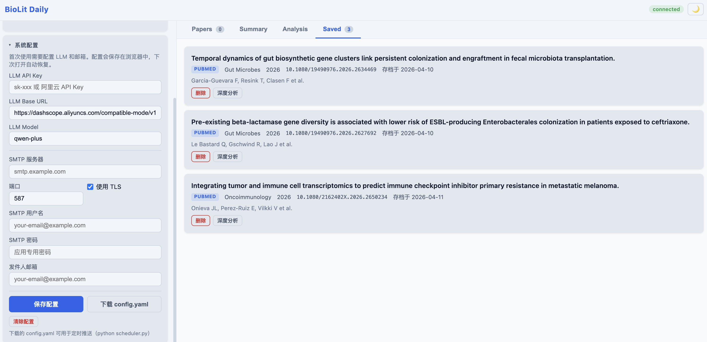

# 文献智能检索与推送系统

[](https://www.python.org/)
[](LICENSE)

一个智能化的文献检索与推送系统，支持从 PubMed、arXiv、bioRxiv 等多源数据库检索文献，使用 LLM 进行智能总结，通过 Web 界面实时交互或自动邮件推送。

## ✨ 核心特性

- 🌐 **Web 可视化界面**：浏览器端实时搜索、结果浏览、深度分析、邮件发送
- 🧠 **LLM 驱动的智能决策**：自然语言需求解析，一次 LLM 调用完成关键词提取+翻译+布尔查询构建
- 🔍 **多源并行检索**：PubMed + arXiv + bioRxiv 并行搜索，OpenAlex 并行补全元数据
- 📄 **单篇论文深度解读**：支持 PMID/DOI/标题/本地 PDF，生成结构化解读报告
- 📊 **并行文献总结**：多线程并行生成每篇论文的中文总结（5 并发，提速 3-5x）
- 📧 **自动邮件推送**：HTML 格式报告，可附带 PDF 原文
- 🎯 **并行严格验证**：LLM 并行验证关键词匹配（5 并发），三级匹配标准
- 📈 **期刊影响因子**：Scimago 数据库 + 常见缩写映射，自动显示 IF
- 🔄 **智能去重**：自动记录已发送文献，避免重复推送
- ⏰ **定时任务**：支持每日自动推送

---

## 🌐 Web 界面功能（v2.0 更新）

启动 Web 服务：
```bash
python web_server.py --port 8080
# 打开 http://127.0.0.1:8080
```

### 界面截图

**系统配置面板 + 收藏文献**（首次使用在此填写 LLM 和邮箱配置）


### 界面功能一览

| 功能 | 说明 |
|------|------|
| **自然语言搜索** | 输入框直接输入中文需求，自动解析关键词、时间、邮箱 |
| **实时进度反馈** | 搜索、验证、总结、翻译各阶段进度条实时推送 |
| **论文卡片展示** | 每篇论文展示完整信息（见下表） |
| **深度分析** | 一键对单篇论文进行 LLM 深度解读，术语解释+图表解读 |
| **高级筛选** | 影响因子范围、期刊、领域、时间范围、验证严格度 |
| **邮件发送** | 勾选论文后一键发送 HTML 邮件报告 |
| **RIS 导出** | 勾选论文导出 EndNote 兼容的 RIS 文件 |
| **收藏管理** | 收藏论文跨会话持久化存储 |
| **浅色/深色主题** | 默认浅色，支持一键切换，无闪烁 |

### 论文卡片显示字段

| 字段 | 说明 |
|------|------|
| 标题 | 可点击跳转原文 |
| Open Access 徽标 | 绿色 OA 标签，一眼识别免费获取 |
| 来源徽标 | PubMed / arXiv / bioRxiv 彩色标签 |
| 期刊名 | 显示期刊全名 |
| **影响因子 (IF)** | 橙色加粗显示，来源 Scimago 数据库 |
| **完整发布日期** | 精确到日（YYYY-MM-DD），非仅年份 |
| 引用数 | 来自 OpenAlex |
| DOI | 单色等宽字体显示 |
| 作者 + 机构 | 前 5 位作者及前 2 位机构 |
| 英文摘要 | 截断 300 字符 |
| **中文摘要翻译** | 开启 `translate_abstract` 后并行翻译，实时推送到卡片下方 |
| 中文总结 | 2-3 句话精简概括 |
| **PDF 下载** | 有 PDF 链接时显示 PDF 按钮，一键下载 |
| DOI / PubMed 链接 | 一键跳转 |
| 深度分析按钮 | 触发单篇 LLM 深度解读 |

### 深度分析面板

点击论文卡片的"深度分析"按钮，触发 LLM 结构化解读：

- **全文概述**：300-500 字综合概述
- **术语解释**：核心术语加粗 + 通俗解释（修复了 `[object Object]` 显示问题）
- **论文实验**：实验设计、数据集、评估指标
- **关键图表解读**：图表编号 + 标题 + 详细解读（修复了 `[object Object]` 显示问题）
- **核心结论**：量化结论列表
- **局限性与展望**

### 实时进度流

Web 端使用 NDJSON 流式推送，搜索全过程可见：

```
[5%]   正在初始化搜索参数...
[10%]  正在检索第 1/1 组查询...
[25%]  去重后共 42 篇，正在进行关键词验证...
[35%]  关键词验证完成，匹配 18 篇
[40%]  搜索完成，共 18 篇文献
[45%]  正在生成文献综述...
[50-90%] 正在为 18 篇论文生成中文总结 (并行处理)...
[90-100%] 正在翻译 18 篇论文摘要...（可选）
```

---

## 🚀 快速开始

### 安装

```bash
# 构建环境
conda create -n bioinfo_ai_literature_daily python=3.13
conda activate bioai_literature_daily

# 安装依赖
pip install -r requirements.txt
```

**核心依赖**：
- `biopython>=1.81` - PubMed API 客户端
- `pydantic>=2.0.0` - 数据验证
- `pyyaml>=6.0` - YAML 配置文件解析
- `schedule>=1.2.0` - 定时任务

**可选依赖**：
- `arxiv>=2.0.0` - arXiv 搜索
- `httpx>=0.25.0` - HTTP 客户端
- `PyMuPDF>=1.23.0` - PDF 文本提取
- `pdfplumber>=0.10.0` - PDF 文本提取（双栏排版更佳）
- `mcp>=1.0.0` - BGPT 结构化论文数据查询

### 配置

#### 方式一：Web 界面配置（推荐，无需手写配置文件）

启动服务后，展开页面左侧「系统配置」面板，填写 LLM API Key 和邮箱 SMTP 信息，点击「保存配置」。配置会保存在浏览器本地，下次打开自动恢复。

如需定时推送，点击「下载 config.yaml」生成配置文件，放到项目目录后运行 `python scheduler.py` 即可。

#### 方式二：手动配置（命令行模式 / 定时推送）

1. **配置 LLM**：
```bash
export LLM_API_KEY='your-api-key'
export LLM_BASE_URL='https://dashscope.aliyuncs.com/compatible-mode/v1'  # 可选
export LLM_MODEL='qwen-plus'  # 可选
```

2. **准备配置文件**：
```bash
cp config.yaml.example config.yaml
```

3. **配置邮箱**（邮件推送需要）：
```yaml
email:
  smtp_server: "smtp.qq.com"
  smtp_port: 587
  smtp_username: "your-email@qq.com"
  smtp_password: "your-authorization-code"  # 授权码，不是密码
  from_email: "your-email@qq.com"
  to_email: "recipient@example.com"
  use_tls: true
```

### 三种运行方式

#### 1. Web 界面（推荐）

```bash
python web_server.py --port 8080
```

打开 `http://127.0.0.1:8080`，输入自然语言需求即可。

#### 2. 命令行智能体模式

```bash
# 交互式
python agent_main.py

# 一行命令
python agent_main.py "找最近7天关于单细胞和AI的文献，发送到example@qq.com"

# 带高级参数
python agent_main.py "找单细胞和AI的文献" \
  --max-results-per-keyword 100 \
  --validation-strictness strict \
  --min-impact-factor 5 \
  --use-unified-search true \
  --email example@qq.com
```

#### 3. 定时推送模式

```bash
python agent_main.py --mode scheduled
```

---

## 📄 单篇论文深度解读

```bash
# PMID
python agent_main.py --paper 38096903

# DOI
python agent_main.py --paper "10.1038/s41586-023-06924-6"

# 论文标题
python agent_main.py --paper "BiOmics: A Foundational Agent"

# 本地 PDF
python agent_main.py --pdf /path/to/paper.pdf --email recipient@example.com
```

**全文获取优先级**：PMC 全文 XML → Unpaywall OA PDF → bioRxiv 直链 → OpenAlex OA URL → 降级为摘要解析

---

## ⚙️ 配置文件说明

```yaml
# 搜索配置
search:
  keywords:
    - "single cell AND AI"
  keyword_operator: "AND"
  strict_keyword_validation: true
  validation_strictness: "very_strict"  # normal/strict/very_strict
  days_back: 7
  max_results_per_keyword: 20
  use_unified_search: true  # PubMed + arXiv + bioRxiv

# 过滤配置
filter:
  min_abstract_length: 100
  allowed_fields: []
  allowed_journals: []
  min_impact_factor: null
  max_impact_factor: null

# 期刊指标
journal_metrics:
  scimago_csv_path: "data/scimagojr 2024.csv"
  scimago_metric: "cites_per_doc_2y"

# 报告配置
report:
  max_papers: 50
  format: "html"
  translate_abstract: false  # 开启后并行翻译英文摘要为中文
```

---

## 🔧 性能优化说明

本系统在以下环节采用了并行化和合并优化：

| 环节 | 优化方式 | 效果 |
|------|---------|------|
| 用户需求解析 | 3 次 LLM 调用合并为 1 次（解析+翻译+运算符） | 延迟减少 ~60% |
| 多源文献检索 | PubMed/arXiv/bioRxiv ThreadPoolExecutor 并行 | ~3x 加速 |
| 严格关键词验证 | LLM 逐篇验证并行化（5 worker） | ~5x 加速 |
| 论文中文总结 | ThreadPoolExecutor 并行（5 worker） | ~5x 加速 |
| OpenAlex 元数据补全 | HTTP 请求并行化（8 worker） | ~8x 加速 |
| 摘要中文翻译 | LLM 翻译并行化（5 worker） | ~5x 加速 |
| LLM 重试策略 | 指数退避 + 随机抖动 | 避免并发限流雪崩 |

---

## 📚 CWTS 领域筛选（RAG 增强）

使用 CWTS 学科体系进行领域增强筛选：

```bash
# 生成 CWTS 映射文件
python3 scripts/process_cwts_data.py

# 含期刊名解析（需联网）
python3 scripts/process_cwts_data.py --resolve-sources --email your@email.com
```

在 `config.yaml` 的 `filter.allowed_fields` 中填写领域名称，或自然语言指令中写 `只看领域 XXX`。

---

## 📝 项目结构

```
bioinfo_ai_literature_daily/
├── web_server.py                  # Web 界面服务端
├── web/                           # Web 前端
│   ├── index.html                 # 主页面
│   └── static/
│       ├── app.js                 # 前端逻辑
│       └── styles.css             # 样式（浅色/深色主题）
├── agent_main.py                  # 智能体模式入口
├── main.py                        # 基础模式入口 + 搜索/过滤/邮件核心
├── scheduler.py                   # 定时任务调度
├── config.yaml                    # 配置文件
├── prompts/                       # LLM 提示词模板
├── literature/                    # 文献检索模块
│   ├── unified_search.py          # 多源并行检索
│   ├── pubmed_client.py
│   ├── arxiv_client.py
│   ├── biorxiv_client.py
│   ├── openalex_client.py         # OpenAlex 元数据补全（并行）
│   ├── paper_fetcher.py           # 单篇论文获取
│   ├── pdf_downloader.py          # PDF 下载与全文提取
│   └── base_client.py             # PaperMetadata 数据模型
├── core/
│   ├── llm/                       # LLM 客户端（支持重试+抖动）
│   ├── config/                    # 配置加载
│   └── rag/
│       ├── scimago_metrics.py     # 期刊 IF 查询（含缩写映射）
│       ├── field_classifier.py    # RAG 领域分类
│       └── cwts_source_filter.py  # CWTS 期刊过滤
├── data/                          # 数据文件
│   └── scimagojr 2024.csv         # Scimago 期刊指标（11MB）
└── cache/                         # 运行时缓存
    ├── sent_papers.json           # 已发送文献记录
    └── saved_papers.json          # Web 收藏文献
```

---

## ⚠️ 注意事项

1. **网络连接**：需要访问 PubMed/arXiv/bioRxiv API
2. **LLM 配置**：Web 界面可直接在「系统配置」面板填写；命令行模式需设置 `LLM_API_KEY` 环境变量
3. **邮件配置**：SMTP 使用授权码而非登录密码
4. **配置安全**：Web 界面保存的配置（含 API Key）仅存于浏览器本地，不写入服务器文件；如需导出请使用「下载 config.yaml」并妥善保管
5. **磁盘空间**：定期清理 `cache/sent_papers.json`

## 🔧 故障排除

| 问题 | 解决方案 |
|------|---------|
| 邮件发送失败 | 检查 SMTP 配置，确认使用授权码 |
| 搜索无结果 | 降低验证严格度（`strict` → `normal`），扩大时间范围 |
| LLM 不可用 | 检查 `LLM_API_KEY` 和 `openai` 库安装 |
| IF 不显示 | 确认 `data/scimagojr 2024.csv` 存在且路径正确 |
| Web 页面黑色闪烁 | 已修复：默认浅色主题，`<head>` 内联脚本消除闪烁 |
| 深度分析显示 `[object Object]` | 已修复：正确渲染术语/图表的对象数组 |

## 📄 许可证

本项目遵循 MIT 许可证。

## 🤝 贡献

欢迎提交 Issue 和 Pull Request！
